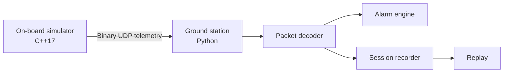

# OrbitOps

A compact CubeSat telemetry and ground-station simulator built to demonstrate how software moves from an on-board system to an operator on the ground.

> **Status:** MVP scaffold. The project is intentionally small, reproducible, and dependency-light so each subsystem can be understood before adding dashboards, observability backends, or a command uplink.

## What it demonstrates

- a C++17 on-board telemetry simulator;
- a binary, CRC-protected telemetry packet;
- UDP transport with deterministic fault injection;
- a Python ground station using only the standard library;
- sequence-gap detection, telemetry alarms, recording, and replay;
- automated C++, Python, and cross-language protocol tests through GitHub Actions.

## Architecture



The first version uses a documented custom packet format inspired by common telemetry design patterns. It is **not presented as CCSDS-compliant**. The on-board simulator currently targets macOS and Linux (or Windows through WSL).

## Demo

### 1. Start the ground station

```bash
python3 -m ground_station.orbitops listen \
  --host 127.0.0.1 \
  --port 9000 \
  --record sessions/demo.jsonl
```

### 2. Build and run the on-board simulator

```bash
cmake -S onboard -B build
cmake --build build

./build/orbitops_sim \
  --host 127.0.0.1 \
  --port 9000 \
  --interval-ms 500 \
  --packets 80 \
  --scenario thermal \
  --drop-every 11
```

The demo produces:

- normal telemetry at startup;
- increasing temperature during the thermal scenario;
- sequence-gap warnings when packets are intentionally skipped;
- a safe-mode transition when the thermal threshold is crossed;
- a JSONL recording that can be replayed later.

### 3. Replay the recorded session

```bash
python3 -m ground_station.orbitops replay sessions/demo.jsonl --speed 4
```

## Packet contents

Each packet carries:

- protocol magic and version;
- sequence number;
- timestamp;
- spacecraft mode;
- battery voltage;
- bus current;
- temperature;
- roll, pitch, and yaw;
- CRC-32.

See [`docs/protocol.md`](docs/protocol.md) for the exact binary layout.

## Repository structure

```text
.
├── onboard/                 # C++ telemetry simulator
├── ground_station/          # Python decoder, receiver, alarms, and replay
├── tests/                   # Python protocol and alarm tests
├── docs/protocol.md         # Binary packet specification
├── scripts/demo.sh          # Local two-terminal demo helper
└── .github/workflows/ci.yml # Build and test workflow
```

## Design principles

- **Understandable first:** no framework is required to inspect the protocol or run the ground station.
- **Deterministic demos:** scenarios and packet loss can be reproduced.
- **Failure-aware:** invalid CRCs, malformed packets, sequence gaps, thermal alerts, and low-voltage alerts are explicit.
- **Extensible:** a link emulator, command uplink, OpenTelemetry export, Datadog integration, or a web dashboard can be added without replacing the protocol core.

## Roadmap

- [ ] Dedicated link emulator for latency, jitter, duplication, and corruption
- [ ] Command uplink with acknowledgements
- [ ] Configurable telemetry schemas
- [ ] OpenTelemetry metrics and logs
- [ ] Optional Datadog dashboard and monitors
- [ ] Web-based mission timeline
- [ ] CCSDS packet-layer research branch

## Testing

```bash
make test
make integration
```

## Positioning

OrbitOps is a portfolio project, not flight software. Its purpose is to make telemetry, fault handling, and ground-segment design concrete, testable, and easy to demonstrate.
