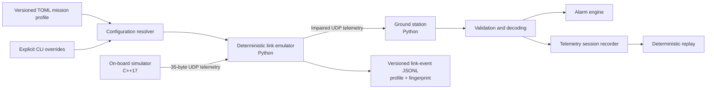

<div align="center">

# OrbitOps

**A dependency-light CubeSat telemetry platform for deterministic link faults, versioned mission profiles, cross-language protocol testing, and operator-focused demos.**

<p>
  <a href="https://github.com/DavCalo/OrbitOps/actions/workflows/ci.yml">
    
  </a>
  
  
  
  <a href="LICENSE">
    
  </a>
  
</p>

</div>

OrbitOps makes an end-to-end telemetry path concrete. A C++ on-board simulator emits fixed-width binary packets; a deterministic UDP link emulator applies reproducible network impairments; a Python ground station validates, decodes, alarms, records, and replays the resulting telemetry.

Versioned TOML mission profiles make link scenarios reusable. Each logged run begins with the selected profile identity and a SHA-256 fingerprint of the **effective** configuration after command-line overrides.

> [!IMPORTANT]
> OrbitOps is a technical-preview simulator and portfolio project. It is **not flight software**, a secure communications system, an RF propagation model, or a claim of CCSDS compliance.

## Product snapshot

| Capability | Current behavior |
|---|---|
| On-board simulation | Deterministic nominal, thermal, and power scenarios in C++17 |
| Telemetry protocol | 35-byte, network-byte-order packet with explicit versioning and CRC-32 |
| Mission profiles | Strict versioned TOML, four built-ins, external files, and deterministic override precedence |
| Link emulation | Seeded loss, latency, jitter, duplication, corruption, and bounded reordering |
| Ground segment | Validation, terminal presentation, alarms, recording, and replay in Python |
| Observability | Link-event schema v2 with run metadata, effective-config fingerprints, and verified summaries |
| Quality gates | Linux/macOS builds, Python compatibility, coverage, typing, sanitizers, packaging, and end-to-end demos |
| Runtime dependencies | Python standard library and platform networking APIs only |

## Architecture



Configuration precedence is:

```text
OrbitOps defaults -> selected profile -> explicit CLI options
```

The binary protocol, mission-profile schema, effective-configuration fingerprint, deterministic impairment semantics, and link-event schema are separate compatibility contracts. See the [architecture](docs/architecture.md), [profile ADR](docs/adr/0002-mission-profile-semantics.md), [run-metadata ADR](docs/adr/0003-link-run-metadata.md), and [event schema](docs/link-event-schema.md).

## Quick start

### Requirements

- Python 3.11 or newer;
- CMake 3.20 or newer;
- a C++17 compiler;
- Linux or macOS. Windows users should use WSL for the simulator.

### 1. Install the Python CLI

```bash
python3 -m venv .venv
source .venv/bin/activate
python -m pip install -e .

orbitops --version
```

### 2. Build the on-board simulator

```bash
cmake -S onboard -B build \
  -DCMAKE_BUILD_TYPE=Release \
  -DORBITOPS_WARNINGS_AS_ERRORS=ON
cmake --build build

./build/orbitops_sim --version
```

### 3. Run the profile-driven installed-CLI demo

```bash
make profile-demo
```

The target launches the installed `orbitops` executable with the `intermittent-loss` built-in profile, sends 16 C++ telemetry packets, decodes the forwarded packets, validates the deterministic drop count, and verifies the logged profile identity, configuration fingerprint, and final counters.

The earlier explicit-option demo remains available as:

```bash
make link-demo
```

## Mission profile workflow

List the stable built-in catalog:

```bash
orbitops profile list
```

Inspect a built-in profile:

```bash
orbitops profile show degraded-link
```

Validate an external UTF-8 TOML file:

```bash
orbitops profile validate file:profiles/lab-pass.toml
```

Run the link emulator from a profile:

```bash
orbitops link \
  --profile degraded-link \
  --listen-port 9001 \
  --forward-port 9000 \
  --event-log sessions/degraded-link-events.jsonl \
  --session-id degraded-pass
```

Explicit impairment options override the profile, including zero:

```bash
orbitops link \
  --profile degraded-link \
  --loss-rate 0 \
  --corrupt-rate 0 \
  --event-log sessions/override-events.jsonl
```

A short reference may select a built-in or an existing file. Use `builtin:<name>` or `file:<path>` when the namespace must be explicit.

## Manual profile-driven mission pass

Terminal 1 — ground station:

```bash
orbitops listen \
  --host 127.0.0.1 \
  --port 9000 \
  --record sessions/thermal-pass.jsonl
```

Terminal 2 — deterministic link emulator:

```bash
orbitops link \
  --profile degraded-link \
  --listen-host 127.0.0.1 \
  --listen-port 9001 \
  --forward-host 127.0.0.1 \
  --forward-port 9000 \
  --event-log sessions/thermal-link-events.jsonl \
  --session-id thermal-pass
```

Terminal 3 — on-board thermal scenario:

```bash
./build/orbitops_sim \
  --host 127.0.0.1 \
  --port 9001 \
  --interval-ms 500 \
  --packets 80 \
  --scenario thermal
```

The pass demonstrates deterministic impairments, spacecraft-state transitions, alarms, sequence anomalies, telemetry recording, and independently auditable link events. Stop unlimited processes with `Ctrl+C`. Replay the telemetry capture with:

```bash
orbitops replay sessions/thermal-pass.jsonl --speed 4
```

## Command-line interfaces

```text
orbitops profile list
orbitops profile show REFERENCE
orbitops profile validate REFERENCE

orbitops link [--profile REFERENCE]
              [--listen-host HOST] [--listen-port PORT]
              [--forward-host HOST] [--forward-port PORT]
              [--seed N] [--loss-rate RATE]
              [--latency-ms N] [--jitter-ms N]
              [--duplicate-rate RATE] [--corrupt-rate RATE]
              [--reorder-window N]
              [--event-log PATH] [--session-id ID]
              [--max-packets N]

orbitops listen [--host HOST] [--port PORT] [--record PATH]
orbitops replay PATH [--speed FACTOR]
orbitops decode PACKET_HEX
orbitops --version

orbitops_sim [--host IPv4] [--port PORT] [--interval-ms N]
             [--packets N] [--drop-every N]
             [--scenario nominal|thermal|power]
```

Invalid profiles and link values are rejected before sockets or event-log files are opened. `--max-packets` makes a run finite and drains delayed or held deliveries before writing the final summary.

## Deterministic link contract

For a fixed seed, effective configuration, and ordered packet stream, OrbitOps produces the same impairment decisions across supported Python versions and platforms. The implementation uses an explicitly specified SplitMix64 generator and consumes a fixed number of draws per input packet.

The canonical effective configuration uses exact hexadecimal floating-point values. Its `sha256:<hex>` fingerprint is stable across equivalent TOML formatting and profile metadata. The fingerprint is reproducibility evidence, **not** a digital signature or authenticity guarantee.

## Link-event observability

New runs emit link-event schema version `2`:

1. one leading `run_metadata` record;
2. packet, impairment, scheduling, reordering, and forwarding records;
3. one final `run_summary` for complete runs.

`run_metadata` records the effective configuration fingerprint and, when used, the profile name, reference, and schema version. Existing packet-event attributes and summary counters remain unchanged. OrbitOps still reads legacy schema-version-1 logs.

Event logs deliberately exclude raw datagram payloads. External profile references and operator-defined session identifiers may still reveal local names or paths and should not contain secrets.

See [`docs/link-event-schema.md`](docs/link-event-schema.md) for the full contract.

## Engineering quality

Install development tools and run the complete local gate:

```bash
make bootstrap
make verify
```

The gate includes Ruff, strict mypy, branch-aware coverage, C++ warnings as errors, C++ tests, cross-language integration, deterministic link integration, the explicit-option demo, the installed profile-driven demo, wheel construction, and packaged profile-resource smoke tests.

## Repository structure

```text
.
├── onboard/                         # C++ simulator and packet encoder
├── ground_station/orbitops/         # Python CLI, decoder, receiver, replay
│   ├── link/                        # Config, fingerprint, events, runtime, scheduler
│   └── profiles/                    # Schema, resolver, catalog, and package resources
├── tests/                           # Unit, compatibility, CLI, and runtime tests
├── docs/                            # Architecture, ADRs, operations, security, schemas
├── scripts/                         # Demos and cross-language integration checks
└── .github/                         # CI, dependency updates, templates, ownership
```

## Roadmap

### Near term

- configurable alarm policy;
- command uplink with acknowledgements;
- parser fuzzing and additional protocol vectors.

### Product experience

- terminal mission timeline;
- web-based session explorer;
- OpenTelemetry metrics and logs;
- optional Datadog dashboard and monitors.

### Research track

- packet families and schema identifiers;
- CCSDS packet-layer research kept separate from the stable custom protocol.

## Governance and security

- [Contributing guide](CONTRIBUTING.md)
- [Security policy](SECURITY.md)
- [Support policy](SUPPORT.md)
- [Code of conduct](CODE_OF_CONDUCT.md)
- [Changelog](CHANGELOG.md)
- [Recommended repository settings](docs/repository-settings.md)

Security issues must be reported privately. The current UDP path is unauthenticated and unencrypted; review the [threat model](docs/threat-model.md) before running beyond localhost.

## License

OrbitOps is available under the [MIT License](LICENSE).
