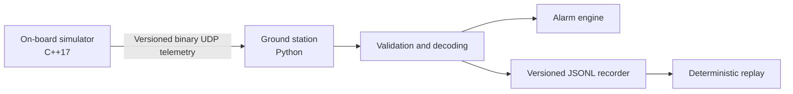

<div align="center">

# OrbitOps

**A dependency-light CubeSat telemetry and ground-station simulator built for deterministic fault scenarios, cross-language protocol testing, and operator-focused demos.**

<p>
  <a href="https://github.com/DavCalo/OrbitOps/actions/workflows/ci.yml">
    
  </a>
  
  
  <a href="LICENSE">
    
  </a>
  
</p>

</div>

OrbitOps makes an end-to-end telemetry path concrete: a C++ on-board simulator emits fixed-width binary packets over UDP; a Python ground station validates, decodes, alarms, records, and replays them.

> [!IMPORTANT]
> OrbitOps is a technical-preview simulator and portfolio project. It is **not flight software**, a secure communications system, or a claim of CCSDS compliance.

## Product snapshot

| Capability | Current behavior |
|---|---|
| On-board simulation | Deterministic nominal, thermal, and power scenarios in C++17 |
| Telemetry protocol | 35-byte, network-byte-order packet with explicit versioning and CRC-32 |
| Link behavior | UDP transmission with deterministic packet-drop injection |
| Ground segment | Validation, terminal presentation, alarms, recording, and replay in Python |
| Quality gates | Linux/macOS builds, Python compatibility, coverage, typing, sanitizers, and cross-language tests |
| Runtime dependencies | Python standard library and platform networking APIs only |

## Architecture



The protocol is deliberately custom and inspectable. It is inspired by common telemetry patterns but is not represented as CCSDS-compliant. See the [architecture](docs/architecture.md), [protocol](docs/protocol.md), and [threat model](docs/threat-model.md).

## Quick start

### Requirements

- Python 3.11 or newer;
- CMake 3.20 or newer;
- a C++17 compiler;
- Linux or macOS. Windows users should use WSL for the simulator.

### 1. Install the ground station

```bash
python3 -m venv .venv
source .venv/bin/activate
python -m pip install -e .

orbitops --version
```

### 2. Build the on-board simulator

```bash
cmake -S onboard -B build \
  -DCMAKE_BUILD_TYPE=Release \
  -DORBITOPS_WARNINGS_AS_ERRORS=ON
cmake --build build

./build/orbitops_sim --version
```

### 3. Run a fault scenario

Terminal 1 — ground station:

```bash
orbitops listen \
  --host 127.0.0.1 \
  --port 9000 \
  --record sessions/demo.jsonl
```

Terminal 2 — thermal scenario with deterministic packet loss:

```bash
./build/orbitops_sim \
  --host 127.0.0.1 \
  --port 9000 \
  --interval-ms 500 \
  --packets 80 \
  --scenario thermal \
  --drop-every 11
```

The session demonstrates:

1. `BOOT → NOMINAL` state transition;
2. increasing thermal telemetry;
3. sequence-gap detection when a packet is skipped;
4. threshold alarms;
5. transition to `SAFE` mode;
6. raw-session recording for later replay.

```bash
orbitops replay sessions/demo.jsonl --speed 4
```

## Command-line interfaces

```text
orbitops listen [--host HOST] [--port PORT] [--record PATH]
orbitops replay PATH [--speed FACTOR]
orbitops decode PACKET_HEX
orbitops --version

orbitops_sim [--host IPv4] [--port PORT] [--interval-ms N]
             [--packets N] [--drop-every N]
             [--scenario nominal|thermal|power]
```

The complete operating procedure and troubleshooting guide are in [`docs/operations.md`](docs/operations.md).

## Protocol guarantees

Protocol version 1 provides:

- fixed-width framing;
- explicit magic and version fields;
- network byte order;
- validated reserved flags;
- bounded integer fields;
- spacecraft-mode validation;
- CRC-32 corruption detection;
- independent C++ encoding and Python decoding;
- cross-language compatibility checks in CI.

CRC-32 is an accidental-corruption check, not cryptographic authentication. Do not use the current transport on an untrusted network.

## Engineering quality

Install development tools and run the full local gate:

```bash
make bootstrap
make verify
```

The gate includes:

- Ruff linting and formatting checks;
- strict mypy type checking;
- branch-aware Python coverage;
- C++ warnings treated as errors;
- C++ unit tests;
- AddressSanitizer and UndefinedBehaviorSanitizer in CI;
- C++ → UDP → Python integration testing;
- Python wheel build and installed-CLI smoke tests.

## Repository structure

```text
.
├── onboard/                    # C++ simulator and packet encoder
├── ground_station/orbitops/    # Python CLI, decoder, alarms, receiver, replay
├── tests/                      # Python behavior and protocol tests
├── docs/                       # Architecture, protocol, operations, security
├── scripts/                    # Demo and cross-language integration helpers
└── .github/                    # CI, dependency updates, templates, ownership
```

## Roadmap

### Near term

- dedicated link emulator for latency, jitter, duplication, corruption, and reordering;
- configurable alarm policy;
- command uplink with acknowledgements;
- golden protocol vectors and parser fuzzing.

### Product experience

- terminal mission timeline;
- web-based session explorer;
- OpenTelemetry metrics and logs;
- optional Datadog dashboard and monitors.

### Research track

- packet families and schema identifiers;
- CCSDS packet-layer research kept separate from the stable custom protocol.

## Governance and security

- [Contributing guide](CONTRIBUTING.md)
- [Security policy](SECURITY.md)
- [Support policy](SUPPORT.md)
- [Code of conduct](CODE_OF_CONDUCT.md)
- [Changelog](CHANGELOG.md)
- [Recommended repository settings](docs/repository-settings.md)

Security issues must be reported privately. The current UDP link is unauthenticated and unencrypted; review the [threat model](docs/threat-model.md) before running beyond localhost.

## License

OrbitOps is available under the [MIT License](LICENSE).
