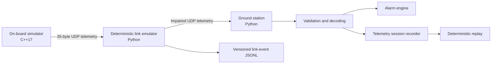

<div align="center">

# OrbitOps

**A dependency-light CubeSat telemetry platform for deterministic link faults, cross-language protocol testing, and operator-focused mission demos.**

<p>
  <a href="https://github.com/DavCalo/OrbitOps/actions/workflows/ci.yml">
    
  </a>
  
  
  
  <a href="LICENSE">
    
  </a>
  
</p>

</div>

OrbitOps makes an end-to-end telemetry path concrete. A C++ on-board simulator emits fixed-width binary packets; a deterministic UDP link emulator applies reproducible network impairments; a Python ground station validates, decodes, alarms, records, and replays the resulting telemetry.

> [!IMPORTANT]
> OrbitOps is a technical-preview simulator and portfolio project. It is **not flight software**, a secure communications system, or a claim of CCSDS compliance.

## Product snapshot

| Capability | Current behavior |
|---|---|
| On-board simulation | Deterministic nominal, thermal, and power scenarios in C++17 |
| Telemetry protocol | 35-byte, network-byte-order packet with explicit versioning and CRC-32 |
| Link emulation | Seeded loss, latency, jitter, duplication, corruption, and bounded reordering |
| Ground segment | Validation, terminal presentation, alarms, recording, and replay in Python |
| Observability | Versioned JSONL link events with independently verified run summaries |
| Quality gates | Linux/macOS builds, Python compatibility, coverage, typing, sanitizers, and cross-language tests |
| Runtime dependencies | Python standard library and platform networking APIs only |

## Architecture



The binary protocol and link-event schema are separate compatibility contracts. The link emulator never changes protocol semantics: it only transforms packet delivery behavior according to an explicit seed and configuration. See the [architecture](docs/architecture.md), [protocol](docs/protocol.md), [link semantics ADR](docs/adr/0001-link-emulator-semantics.md), and [event schema](docs/link-event-schema.md).

## Quick start

### Requirements

- Python 3.11 or newer;
- CMake 3.20 or newer;
- a C++17 compiler;
- Linux or macOS. Windows users should use WSL for the simulator.

### 1. Install the Python CLI

```bash
python3 -m venv .venv
source .venv/bin/activate
python -m pip install -e .

orbitops --version
```

### 2. Build the on-board simulator

```bash
cmake -S onboard -B build \
  -DCMAKE_BUILD_TYPE=Release \
  -DORBITOPS_WARNINGS_AS_ERRORS=ON
cmake --build build

./build/orbitops_sim --version
```

### 3. Run the automated public-CLI demo

```bash
make link-demo
```

This launches the simulator through the installed `orbitops link` workflow, decodes the forwarded packets, and verifies the final JSONL run summary.

## Manual impaired mission pass

Terminal 1 — ground station:

```bash
orbitops listen \
  --host 127.0.0.1 \
  --port 9000 \
  --record sessions/thermal-pass.jsonl
```

Terminal 2 — deterministic link emulator:

```bash
orbitops link \
  --listen-host 127.0.0.1 \
  --listen-port 9001 \
  --forward-host 127.0.0.1 \
  --forward-port 9000 \
  --seed 42 \
  --loss-rate 0.05 \
  --latency-ms 120 \
  --jitter-ms 30 \
  --duplicate-rate 0.02 \
  --corrupt-rate 0.01 \
  --reorder-window 3 \
  --event-log sessions/thermal-link-events.jsonl \
  --session-id thermal-pass
```

Terminal 3 — on-board thermal scenario:

```bash
./build/orbitops_sim \
  --host 127.0.0.1 \
  --port 9001 \
  --interval-ms 500 \
  --packets 80 \
  --scenario thermal
```

The pass demonstrates:

1. `BOOT → NOMINAL` spacecraft-state transition;
2. increasing thermal telemetry and threshold alarms;
3. deterministic packet loss and sequence-gap detection;
4. delayed, duplicated, corrupted, and reordered deliveries;
5. transition to `SAFE` mode;
6. raw telemetry recording and independently auditable link events.

Stop the unlimited listener or link process with `Ctrl+C`. Replay the telemetry capture with:

```bash
orbitops replay sessions/thermal-pass.jsonl --speed 4
```

## Command-line interfaces

```text
orbitops listen [--host HOST] [--port PORT] [--record PATH]

orbitops link [--listen-host HOST] [--listen-port PORT]
              [--forward-host HOST] [--forward-port PORT]
              [--seed N] [--loss-rate RATE]
              [--latency-ms N] [--jitter-ms N]
              [--duplicate-rate RATE] [--corrupt-rate RATE]
              [--reorder-window N]
              [--event-log PATH] [--session-id ID]
              [--max-packets N]

orbitops replay PATH [--speed FACTOR]
orbitops decode PACKET_HEX
orbitops --version

orbitops_sim [--host IPv4] [--port PORT] [--interval-ms N]
             [--packets N] [--drop-every N]
             [--scenario nominal|thermal|power]
```

All rates are finite values in the inclusive range `0.0` to `1.0`. Invalid link configuration is rejected before sockets are opened. `--max-packets` is useful for finite tests and automation; omitted values keep the emulator running until an operator stop.

The complete operating procedure and troubleshooting guide are in [`docs/operations.md`](docs/operations.md).

## Deterministic link contract

For a fixed seed, configuration, and ordered packet stream, OrbitOps produces the same impairment decisions across supported Python versions and platforms. The implementation uses an explicitly specified SplitMix64 generator and consumes a fixed number of draws per input packet.

The contract covers:

- drop, duplication, and corruption decisions;
- one-bit corruption position;
- fixed latency plus bounded uniform jitter;
- bounded packet-hold reordering;
- stable ordering of duplicate deliveries;
- golden PRNG vectors and combined impairment decisions.

Live monotonic timestamps and automatically generated session identifiers are operational metadata, not deterministic decision inputs.

## Link-event observability

A link run can emit canonical JSONL records for every receive, impairment, schedule, forward, and observed reorder. Complete runs end with `run_summary`; its counters are independently recomputed and validated by the test suite.

Event logs deliberately exclude raw datagram payloads. They include packet indices, timing metadata, impairment decisions, delivery metadata, and final counters. Interrupted runs remain structurally readable even when no summary was written.

See [`docs/link-event-schema.md`](docs/link-event-schema.md) for the full versioned schema.

## Protocol guarantees

Protocol version 1 provides:

- fixed-width framing;
- explicit magic and version fields;
- network byte order;
- validated reserved flags;
- bounded integer fields;
- spacecraft-mode validation;
- CRC-32 corruption detection;
- independent C++ encoding and Python decoding;
- cross-language compatibility checks in CI.

CRC-32 is an accidental-corruption check, not cryptographic authentication. Do not use the current transport on an untrusted network.

## Engineering quality

Install development tools and run the full local gate:

```bash
make bootstrap
make verify
```

The gate includes:

- Ruff linting and formatting checks;
- strict mypy type checking;
- branch-aware Python coverage;
- C++ warnings treated as errors;
- C++ unit tests;
- AddressSanitizer and UndefinedBehaviorSanitizer in CI;
- C++ → UDP → Python integration testing;
- C++ → link runtime → Python integration testing;
- public `orbitops link` end-to-end validation;
- Python wheel build and installed-CLI smoke tests.

## Repository structure

```text
.
├── onboard/                         # C++ simulator and packet encoder
├── ground_station/orbitops/         # Python CLI, decoder, alarms, receiver, replay
│   └── link/                        # Deterministic impairments, scheduler, runtime, events
├── tests/                           # Python behavior, protocol, link, and CLI tests
├── docs/                            # Architecture, protocol, operations, security, schemas
├── scripts/                         # Demo and cross-language integration helpers
└── .github/                         # CI, dependency updates, templates, ownership
```

## Roadmap

### Near term

- reusable link-impairment configuration profiles;
- configurable alarm policy;
- command uplink with acknowledgements;
- parser fuzzing and additional protocol vectors.

### Product experience

- terminal mission timeline;
- web-based session explorer;
- OpenTelemetry metrics and logs;
- optional Datadog dashboard and monitors.

### Research track

- packet families and schema identifiers;
- CCSDS packet-layer research kept separate from the stable custom protocol.

## Governance and security

- [Contributing guide](CONTRIBUTING.md)
- [Security policy](SECURITY.md)
- [Support policy](SUPPORT.md)
- [Code of conduct](CODE_OF_CONDUCT.md)
- [Changelog](CHANGELOG.md)
- [Recommended repository settings](docs/repository-settings.md)

Security issues must be reported privately. The current UDP path is unauthenticated and unencrypted; review the [threat model](docs/threat-model.md) before running beyond localhost.

## License

OrbitOps is available under the [MIT License](LICENSE).
