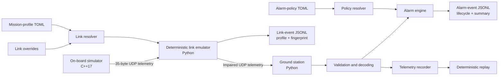
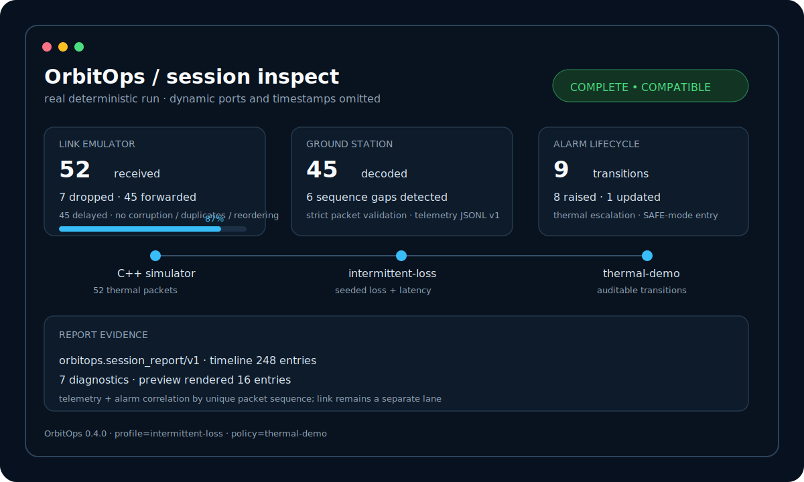

<div align="center">

# OrbitOps

**A dependency-light CubeSat telemetry platform for deterministic link faults, versioned mission profiles, auditable alarm lifecycles, and cross-language operator demos.**

<p>
  <a href="https://github.com/DavCalo/OrbitOps/actions/workflows/ci.yml">
    
  </a>
  
  
  
  <a href="LICENSE">
    
  </a>
  
</p>

</div>

OrbitOps makes an end-to-end telemetry path concrete. A C++ on-board simulator emits
fixed-width binary packets; a deterministic UDP link emulator applies reproducible network
impairments; a Python ground station validates, decodes, alarms, records, and replays the
resulting telemetry. A unified session inspector then produces deterministic operator text and
versioned JSON reports from the independently validated telemetry, link, and alarm evidence.

Versioned TOML mission profiles make link scenarios reusable. Versioned alarm policies make
thresholds and hysteresis explicit. Link and alarm logs begin with the effective configuration
or policy identity and a SHA-256 fingerprint of behavior-affecting values.

> [!IMPORTANT]
> OrbitOps is a technical-preview simulator and portfolio project. It is **not flight
> software**, a secure communications system, an RF propagation model, or a claim of CCSDS
> compliance. Built-in alarm values are deterministic examples, not certified operational
> limits.

## Product snapshot

| Capability | Current behavior |
|---|---|
| On-board simulation | Deterministic nominal, thermal, and power scenarios in C++17 |
| Telemetry protocol | 35-byte, network-byte-order packet with explicit versioning and CRC-32 |
| Mission profiles | Strict versioned TOML, four built-ins, external files, and deterministic override precedence |
| Alarm policies | Strict versioned TOML, four built-ins, external files, hysteresis, and stable fingerprints |
| Link emulation | Seeded loss, latency, jitter, duplication, corruption, and bounded reordering |
| Alarm lifecycle | Session-scoped raised, updated, and cleared transitions with stable identities |
| Observability | Separate link-event and alarm-event JSONL with metadata and verified summaries |
| Session inspection | Deterministic text and versioned JSON reports with explicit diagnostics, filters, and exit codes |
| Parser assurance | Bounded deterministic mutations and malformed-input corpora for every public parser |
| Quality gates | Linux/macOS builds, Python compatibility, coverage, typing, sanitizers, packaging, and installed demos |
| Runtime dependencies | Python standard library and platform networking APIs only |

## Architecture



Link configuration precedence is:

```text
OrbitOps defaults -> selected profile -> explicit CLI options
```

Alarm behavior comes from one selected policy. Omitting `--alarm-policy` uses
`builtin:standard`, which preserves the v0.3 effective thresholds.

The binary protocol, telemetry recording, mission-profile schema, link fingerprint, link-event
schema, alarm-policy schema, lifecycle semantics, and alarm-event schema are separate
compatibility contracts. See the [architecture](docs/architecture.md),
[alarm lifecycle ADR](docs/adr/0003-alarm-lifecycle-semantics.md),
[alarm-event ADR](docs/adr/0004-alarm-event-compatibility.md), and
[alarm-event schema](docs/alarm-event-schema.md).

## Quick start

### Requirements

- Python 3.11 or newer;
- CMake 3.20 or newer;
- a C++17 compiler;
- Linux or macOS. Windows users should use WSL for the simulator.

### 1. Install the Python CLI

```bash
python3 -m venv .venv
source .venv/bin/activate
python -m pip install -e .

orbitops --version
```

### 2. Build the on-board simulator

```bash
cmake -S onboard -B build       -DCMAKE_BUILD_TYPE=Release       -DORBITOPS_WARNINGS_AS_ERRORS=ON
cmake --build build

./build/orbitops_sim --version
```

### 3. Run the flagship session-inspection demo

```bash
make session-demo
```

This installed workflow runs the C++ thermal simulator through the deterministic
`intermittent-loss` profile and the `thermal-demo` alarm policy. It records telemetry, link events,
and alarm transitions, then invokes `orbitops session inspect` to produce one bounded operator
report.



What to notice:

- the seeded link applies latency and drops seven of 52 packets;
- 45 forwarded packets become validated telemetry with six explicit sequence gaps;
- temperature warning, critical escalation, and SAFE-mode transitions remain auditable;
- alarm transitions correlate to unique telemetry packet sequences;
- link events remain a separate evidence lane rather than claiming packet equivalence;
- the final report is complete, compatible, versioned, and explicitly truncated for presentation.

The visual is generated from validated real demo output. Dynamic ports, temporary paths, run
identifiers, and timestamps are omitted from the static representation.

Focused workflows remain available:

```bash
make alarm-demo
make profile-demo
```

## Session-inspection workflow

Inspect any supported combination of telemetry, link-event, and alarm-event evidence:

```bash
orbitops session inspect \
  --telemetry sessions/mission-telemetry.jsonl \
  --link-events sessions/mission-link-events.jsonl \
  --alarm-events sessions/mission-alarms.jsonl
```

The default text report preserves source-local ordering and clock domains. Use deterministic,
versioned JSON for automation:

```bash
orbitops session inspect \
  --telemetry sessions/mission-telemetry.jsonl \
  --link-events sessions/mission-link-events.jsonl \
  --alarm-events sessions/mission-alarms.jsonl \
  --format json \
  --output sessions/mission-report.json
```

Filters restrict rendered timeline entries without changing whole-session counters. Supported
filters cover packet-sequence bounds, exact alarm code, alarm severity, and an explicit event
limit. See the [session-inspection contract](docs/session-inspection.md) for report semantics,
atomic output behavior, compatibility boundaries, and exit codes.

## Alarm-policy workflow

List the stable built-in catalog:

```bash
orbitops alarm-policy list
```

Inspect one policy and its effective fingerprint:

```bash
orbitops alarm-policy show thermal-demo
```

Validate an external UTF-8 TOML policy:

```bash
orbitops alarm-policy validate file:policies/lab-policy.toml
```

Record a direct thermal pass:

```bash
orbitops listen       --host 127.0.0.1       --port 9000       --alarm-policy thermal-demo       --record sessions/thermal-telemetry.jsonl       --alarm-log sessions/thermal-alarms.jsonl
```

In another terminal:

```bash
./build/orbitops_sim       --host 127.0.0.1       --port 9000       --interval-ms 100       --packets 52       --scenario thermal
```

Stop the listener with `Ctrl+C` after the simulator completes. Cooperative shutdown writes the
final alarm summary.

## Alarm-event observability

A complete schema-version-1 alarm log contains:

1. one leading `run_metadata` record with policy identity and fingerprint;
2. typed `alarm_raised`, `alarm_updated`, and `alarm_cleared` records;
3. one final `run_summary`.

The deterministic thermal demo validates:

```text
sequence 7  -> alarm_raised  ELEVATED_TEMPERATURE
sequence 18 -> alarm_updated HIGH_TEMPERATURE
sequence 51 -> alarm_raised  SAFE_MODE
```

Alarm logs include packet sequence, stable identity, code, severity, observed value, threshold,
and human-readable message. They exclude raw packet bytes. Telemetry recordings remain a
separate schema and file.

Inspect a complete alarm log:

```bash
python - <<'PY'
from pathlib import Path
from orbitops.alarm_events import (
    load_alarm_events,
    run_metadata_from_events,
    validate_run_summary,
)

events = load_alarm_events(Path("sessions/thermal-alarms.jsonl"))
print(run_metadata_from_events(events))
print(validate_run_summary(events))
PY
```

A cooperatively interrupted listener writes the summary. Abrupt termination may leave an
inspectable partial log without one.

## Mission-profile workflow

```bash
orbitops profile list
orbitops profile show degraded-link
orbitops profile validate file:profiles/lab-pass.toml
```

Run the link emulator from a profile:

```bash
orbitops link       --profile degraded-link       --listen-port 9001       --forward-port 9000       --event-log sessions/degraded-link-events.jsonl       --session-id degraded-pass
```

Explicit impairment options override the profile, including zero. A short reference may select
a built-in or existing file. Use `builtin:<name>` or `file:<path>` when the namespace must be
explicit.

## Manual profile-driven mission pass

Terminal 1 — ground station:

```bash
orbitops listen       --host 127.0.0.1       --port 9000       --alarm-policy conservative       --record sessions/mission-telemetry.jsonl       --alarm-log sessions/mission-alarms.jsonl
```

Terminal 2 — deterministic link emulator:

```bash
orbitops link       --profile degraded-link       --listen-host 127.0.0.1       --listen-port 9001       --forward-host 127.0.0.1       --forward-port 9000       --event-log sessions/mission-link-events.jsonl       --session-id mission-pass
```

Terminal 3 — on-board thermal scenario:

```bash
./build/orbitops_sim       --host 127.0.0.1       --port 9001       --interval-ms 500       --packets 80       --scenario thermal
```

The pass demonstrates deterministic impairments, state transitions, lifecycle alarms, sequence
anomalies, telemetry recording, and independently auditable link and alarm events.

Replay the telemetry capture with:

```bash
orbitops replay sessions/mission-telemetry.jsonl --speed 4
```

## Command-line interfaces

```text
orbitops profile list
orbitops profile show REFERENCE
orbitops profile validate REFERENCE

orbitops alarm-policy list
orbitops alarm-policy show REFERENCE
orbitops alarm-policy validate REFERENCE

orbitops link [--profile REFERENCE]
              [--listen-host HOST] [--listen-port PORT]
              [--forward-host HOST] [--forward-port PORT]
              [--seed N] [--loss-rate RATE]
              [--latency-ms N] [--jitter-ms N]
              [--duplicate-rate RATE] [--corrupt-rate RATE]
              [--reorder-window N]
              [--event-log PATH] [--session-id ID]
              [--max-packets N]

orbitops listen [--host HOST] [--port PORT]
                [--record PATH]
                [--alarm-policy REFERENCE]
                [--alarm-log PATH]

orbitops session inspect
                         [--telemetry PATH]
                         [--link-events PATH]
                         [--alarm-events PATH]
                         [--format text|json]
                         [--sequence-min N] [--sequence-max N]
                         [--alarm-code CODE]
                         [--alarm-severity warning|critical]
                         [--limit N] [--output PATH]

orbitops replay PATH [--speed FACTOR]
orbitops decode PACKET_HEX
orbitops --version

orbitops_sim [--host IPv4] [--port PORT] [--interval-ms N]
             [--packets N] [--drop-every N]
             [--scenario nominal|thermal|power]
```

Invalid profiles, policies, and values are rejected before associated sockets or logs open.

## Deterministic contracts

For a fixed seed, effective link configuration, and ordered packet stream, OrbitOps produces the
same impairment decisions across supported Python versions and platforms. The implementation
uses an explicitly specified SplitMix64 generator and fixed draw order.

For a fixed alarm policy and ordered decoded packet stream, lifecycle transitions use fixed
alarm ordering and explicit hysteresis boundaries. Equality remains active; recovery must cross
beyond the configured clear boundary.

Fingerprints are reproducibility evidence, **not** signatures, authenticity guarantees,
authorization controls, or provenance proofs.

## Parser assurance

Normal CI runs deterministic bounded malformed-input tests for:

- the binary packet decoder;
- telemetry recording JSONL;
- link-event JSONL;
- alarm-event JSONL;
- mission-profile TOML;
- alarm-policy TOML.

Regression fixtures contain no credentials or private telemetry. Continuous coverage-guided
fuzzing remains separate from the normal pull-request budget.

## Engineering quality

Install development tools and run the complete local gate:

```bash
make bootstrap
make verify
```

The gate includes Ruff, strict mypy, branch-aware coverage, C++ warnings as errors, C++ tests,
cross-language integration, deterministic link integration, installed profile and alarm demos,
wheel construction, package-resource checks, alarm-event validation, and the installed
session-inspection workflow.

## Repository structure

```text
.
├── onboard/                         # C++ simulator and packet encoder
├── ground_station/orbitops/         # Python CLI, decoder, receiver, replay
│   ├── alarm_policies/              # Policy schema, resolver, catalog, resources
│   ├── alarm_events.py              # Canonical alarm lifecycle JSONL
│   ├── link/                        # Config, fingerprint, events, runtime, scheduler
│   ├── profiles/                    # Profile schema, resolver, catalog, resources
│   └── session/                     # Correlation, normalization, reports, public CLI
├── tests/                           # Unit, compatibility, parser, CLI, runtime tests
├── docs/                            # Architecture, ADRs, operations, security, schemas
├── scripts/                         # Installed demos and package/integration checks
└── .github/                         # CI, dependency updates, templates, ownership
```

## Roadmap

### Near term

- complete the unified session-inspection operator demo;
- publish reproducible benchmark and soak evidence;
- finish release documentation and clean-install verification.

### Product experience

- web-based session explorer;
- OpenTelemetry metrics and logs;
- optional Datadog dashboard and monitors;
- command uplink with acknowledgements after the v0.5 inspection milestone.

### Research track

- CCSDS packet-layer research kept separate from the stable custom protocol;
- signed run manifests where provenance requirements justify them.

## Governance and security

- [Contributing guide](CONTRIBUTING.md)
- [Security policy](SECURITY.md)
- [Support policy](SUPPORT.md)
- [Code of conduct](CODE_OF_CONDUCT.md)
- [Changelog](CHANGELOG.md)
- [Recommended repository settings](docs/repository-settings.md)

Security issues must be reported privately. The current UDP path is unauthenticated and
unencrypted; review the [threat model](docs/threat-model.md) before running beyond localhost.

## License

OrbitOps is available under the [MIT License](LICENSE).
