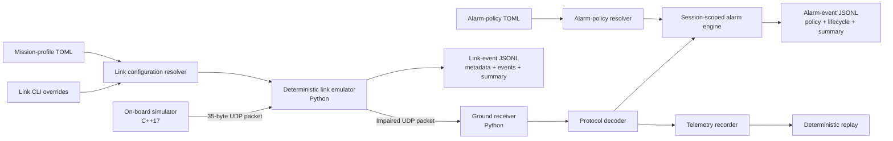

# Architecture

OrbitOps models a compact telemetry path with an on-board producer, deterministic link
boundary, and ground consumer. Versioned mission profiles configure link behavior while
versioned alarm policies configure operator-facing lifecycle decisions.



## Component boundaries

### Mission-profile subsystem

Responsibilities:

- parse strict versioned TOML using `tomllib`;
- reject unknown fields, invalid types, unsupported versions, and invalid link values;
- load built-in package resources and explicit UTF-8 files;
- resolve ambiguous references explicitly;
- return immutable profile and `LinkConfig` models.

Profile documents are data-only. They do not execute code, interpolate environment variables,
fetch remote content, or contain credentials.

### Link configuration resolver

The resolver applies:

```text
LinkConfig defaults -> selected profile -> explicit CLI options
```

Omitted CLI options preserve profile values. Explicit zero values remain valid overrides. The
resolved `LinkConfig` is encoded canonically and fingerprinted before event-log creation or
socket construction.

### Alarm-policy subsystem

Responsibilities:

- parse strict alarm-policy schema version `1`;
- validate temperature, battery, mode, sequence, and hysteresis semantics;
- load four built-in policies or explicit local UTF-8 files;
- reject missing, ambiguous, malformed, and unsupported references before receiver delegation;
- produce immutable policies and stable fingerprints of behavior-affecting fields.

The `standard` policy preserves the v0.3 effective thresholds and zero hysteresis. Policy
identity and descriptions do not alter the effective fingerprint.

### On-board simulator

Responsibilities:

- generate deterministic nominal, thermal, and power scenarios;
- encode protocol-version-1 packets;
- send complete datagrams to one IPv4 destination;
- optionally inject backwards-compatible transmitter-side packet loss.

It does not model flight hardware timing guarantees.

### Link emulator

Responsibilities:

- receive an ordered UDP datagram stream;
- derive deterministic impairment decisions from an effective configuration;
- schedule delayed, duplicated, corrupted, and held deliveries;
- forward complete datagrams;
- emit one leading run-metadata record, packet events, and a final summary;
- close sockets cleanly after finite completion or cooperative stop.

The impairment engine remains pure and independent from sockets. The scheduler consumes
immutable outcomes and caller-provided monotonic timestamps.

### Ground station and alarm engine

Responsibilities:

- receive and validate datagrams;
- reject malformed, unsupported, or CRC-invalid packets;
- present decoded telemetry;
- evaluate one ordered stream with a session-scoped `AlarmEngine`;
- emit only raised, updated, and cleared lifecycle changes;
- record raw telemetry sessions separately from decoded alarm events.

Stable alarm identities represent temperature, battery, SAFE mode, and sequence-gap
occurrences. Deterministic ordering is sequence integrity, temperature, battery, then mode.

### Alarm-event recorder

The recorder writes canonical schema-version-1 JSONL:

1. leading policy-aware `run_metadata`;
2. lifecycle transitions with packet sequence and decision metadata;
3. a final independently verifiable `run_summary`.

It flushes every event. Cooperative listener shutdown unwinds the recorder context and writes
the summary. Abrupt termination may leave an inspectable partial log without a summary.

### Session inspection boundary

The v0.5 inspector consumes telemetry recordings, link events, and alarm events through
their existing strict validators. It does not merge their schemas or claim a shared run identity.
Telemetry and alarm transitions may correlate by a unique decoded packet sequence; link events
remain a separate lane because `packet_index` is not telemetry `packet_sequence`. Process-local
elapsed clocks and unsynchronized wall clocks are never combined into a fabricated global
timeline.

Source-local order remains authoritative. Cross-lane precedence is deterministic presentation
only, not causal or temporal evidence. See
[ADR 0005](adr/0005-session-correlation-semantics.md).

### Session report adapter

The public `orbitops session inspect` adapter projects the immutable normalized session into
operator text or `orbitops.session_report/v1` JSON. Report metadata, source summaries, diagnostics,
and unfiltered counters describe the complete selected evidence bundle. Filters and event limits
change only the rendered timeline projection.

Text and JSON serialization are deterministic. JSON contains no ANSI presentation sequences.
When `--output` is selected, the adapter writes a temporary file in the destination directory,
flushes it, and replaces the destination atomically. A failed write leaves no misleading new
report and does not destroy an existing destination.

The command maps complete, incomplete, incompatible, malformed, and I/O outcomes to distinct exit
codes. Presentation behavior remains outside the strict evidence loaders and normalized core.
See the [session-inspection contract](session-inspection.md).

## Compatibility contracts

OrbitOps maintains separate contracts for:

1. the 35-byte telemetry protocol;
2. deterministic SplitMix64 impairment decisions;
3. mission-profile schema and built-in values;
4. canonical effective-link encoding and fingerprinting;
5. link-event JSONL;
6. alarm-policy schema, catalog, and effective fingerprints;
7. deterministic alarm lifecycle semantics;
8. alarm-event JSONL;
9. telemetry recording and replay JSONL;
10. unified session-correlation semantics;
11. versioned session-report serialization and CLI exit-code semantics.

Changing one contract does not silently redefine another. Profile or policy identity metadata
does not affect the corresponding effective fingerprint.

Link-event schema version `2` preserves version-1 reading. Alarm-event schema begins at
version `1`. Telemetry recordings retain record version `1`.

## Deterministic data flow

For every input datagram, the impairment engine consumes a fixed sequence of six SplitMix64
outputs. The scheduler orders eligible deliveries by deadline, packet index, and copy index.

For every decoded packet, the alarm engine evaluates sequence integrity, temperature, battery,
and mode in a fixed order. Hysteresis equality remains active; recovery must move strictly
beyond the configured boundary.

The deterministic contract excludes wall-clock timestamps, OS scheduling, ephemeral ports,
and automatically generated session identifiers.

## Observability flow

Link logs identify the effective link configuration and impairment outcomes. Alarm logs
identify the effective policy and lifecycle outcomes. Complete logs are accepted only when
their final summaries match independently recomputed counters.

Raw datagram payloads are excluded from both observability logs. Raw telemetry is persisted
only through the separate session recorder.

Unified inspection treats selected files as an operator-provided evidence bundle. A unique
telemetry/alarm packet-sequence match is exact at the field level, while bundle provenance
remains unverified. Link and alarm session identifiers use independent namespaces.

## Design decisions

- Runtime dependencies remain limited to the Python standard library and platform APIs.
- UDP keeps datagram boundaries and impairment behavior explicit.
- Telemetry, link-event, and alarm-event logs remain separate formats.
- Built-in profiles and policies are deterministic examples and fixtures, not certified limits.
- SHA-256 fingerprints identify equivalent effective behavior but do not authenticate it.
- Strict parser corpora remain bounded and offline in normal CI.
- OrbitOps remains a development simulator, not flight software.

## Extension points

- command uplink and acknowledgements;
- continuous coverage-guided fuzzing outside the normal pull-request budget;
- event sink adapters for OpenTelemetry or Datadog;
- terminal or web mission timeline;
- signed run manifests where provenance is justified;
- CCSDS research adapters kept separate from the stable custom protocol.
