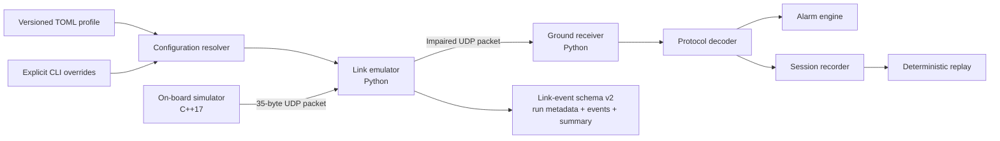

# Architecture

OrbitOps models a compact telemetry path with an on-board producer, a deterministic link boundary, and a ground consumer. Versioned mission profiles now sit before the link boundary as reusable configuration inputs.



## Component boundaries

### Mission-profile subsystem

Responsibilities:

- parse strict versioned TOML using `tomllib`;
- reject unknown fields, invalid types, unsupported versions, and invalid link values;
- load built-in package resources and explicit UTF-8 files;
- resolve ambiguous references explicitly;
- return immutable profile and `LinkConfig` models.

Profile documents are data-only. They do not execute code, interpolate environment variables, fetch remote content, or contain credentials.

### Configuration resolver

The resolver applies:

```text
LinkConfig defaults -> selected profile -> explicit CLI options
```

Omitted CLI options preserve profile values. Explicit zero values remain valid overrides. The resolved `LinkConfig` is encoded canonically and fingerprinted before event-log creation or socket construction.

The canonical representation and fingerprint are owned by the link configuration layer. `orbitops.profiles` retains compatibility exports for profile callers.

### On-board simulator

Responsibilities:

- generate deterministic spacecraft state;
- encode protocol-version-1 packets;
- send complete datagrams to one IPv4 destination;
- optionally inject backwards-compatible transmitter-side packet loss.

It does not model flight hardware timing guarantees.

### Link emulator

Responsibilities:

- receive an ordered UDP datagram stream;
- derive deterministic impairment decisions from an effective configuration;
- schedule delayed, duplicated, corrupted, and held deliveries;
- forward complete datagrams;
- emit one leading run-metadata record, packet events, and a final summary;
- close sockets cleanly after finite completion or cooperative stop.

The impairment engine remains pure and independent from sockets. The scheduler consumes immutable outcomes and caller-provided monotonic timestamps.

### Ground station

Responsibilities:

- receive and validate datagrams;
- reject malformed, unsupported, or CRC-invalid packets;
- present telemetry and alarms;
- record and replay raw packet sessions.

## Compatibility contracts

OrbitOps maintains separate contracts for:

1. the 35-byte telemetry protocol;
2. deterministic SplitMix64 impairment decisions;
3. mission-profile schema and built-in values;
4. canonical effective-configuration encoding and fingerprinting;
5. link-event JSONL.

Changing one contract does not silently redefine another. Profile metadata does not affect the effective-configuration fingerprint.

Link-event schema version `2` adds `run_metadata` while preserving version-1 reading and all existing packet-event and summary-counter meanings.

## Deterministic data flow

For every input datagram, the impairment engine consumes a fixed sequence of six SplitMix64 outputs. The scheduler orders eligible deliveries by deadline, packet index, and copy index.

The deterministic contract includes configuration resolution, fingerprinting, impairment decisions, and delivery order. It excludes wall-clock timestamps, OS scheduling, ephemeral ports, and automatically generated session identifiers.

## Observability flow

A new run emits:

1. `run_metadata` with profile identity and effective-configuration fingerprint;
2. receive and selected impairment records;
3. one scheduling record per delivery;
4. observed reorder records;
5. successful forwarding records;
6. final `run_summary`.

Statistics remain derived only from packet and delivery events. Complete logs are valid only when the final summary matches an independent recomputation.

## Design decisions

- Runtime dependencies remain limited to the Python standard library and platform networking APIs.
- UDP keeps datagram boundaries and impairment behavior explicit.
- Ground telemetry recordings and link-event logs remain separate formats.
- Built-in profiles are reproducible examples and fixtures, not RF-channel models.
- SHA-256 fingerprints identify equivalent effective configurations but do not authenticate them.
- OrbitOps remains a development simulator, not flight software.

## Extension points

- configurable alarm policy;
- command uplink and acknowledgements;
- event sink adapters for OpenTelemetry or Datadog;
- terminal or web mission timeline;
- signed run manifests where provenance is justified;
- CCSDS research adapters kept separate from the stable custom protocol.
