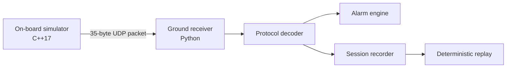

# Architecture

OrbitOps models the smallest useful end-to-end telemetry path: an on-board producer, a transport boundary, and a ground consumer.

## Component boundaries

### On-board simulator

Responsibilities:

- generate deterministic spacecraft state;
- encode protocol version 1 packets;
- inject selected transmission loss;
- send complete datagrams to one IPv4 destination.

It does not decode commands, persist state, or model hardware timing guarantees.

### Protocol

The binary protocol is the interoperability contract between C++ and Python. The reference layout is documented in [`protocol.md`](protocol.md), implemented independently in both languages, and checked by cross-language integration tests.

Protocol changes require:

1. an explicit versioning decision;
2. updated documentation;
3. compatibility or migration notes;
4. golden-vector and integration tests.

### Ground station

Responsibilities:

- receive and validate datagrams;
- reject malformed, unsupported, or CRC-invalid packets;
- present decoded telemetry;
- derive alarms and sequence anomalies;
- record and replay raw packet sessions.

Presentation is intentionally terminal-first. A future TUI or web UI should consume the same decoder and event model rather than duplicate protocol logic.

## Design decisions

### Dependency-light runtime

The Python runtime uses only the standard library and the C++ simulator uses system networking APIs. Development tooling is isolated in the optional `dev` extra.

### UDP transport

UDP keeps packet boundaries visible and makes loss injection straightforward. Reliability, ordering, authentication, and confidentiality are intentionally out of scope for protocol version 1.

### Fixed-width packet

A fixed 35-byte layout is easy to inspect and test across languages. Future payload families should add a packet type or schema identifier instead of silently changing field meaning.

### Deterministic scenarios

Faults and state transitions are derived from sequence number and explicit CLI arguments. Repeatable behavior is preferred over realism that cannot be tested.

## Extension points

- dedicated link emulator between simulator and receiver;
- command uplink and acknowledgements;
- configurable alarm policy;
- event sink interface for OpenTelemetry or Datadog;
- terminal or web mission timeline;
- CCSDS research adapter kept separate from the stable custom protocol.
