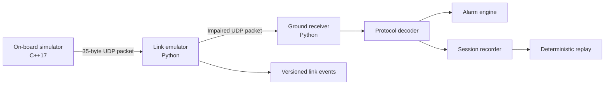

# Architecture

OrbitOps models a compact end-to-end telemetry path with three independently testable stages: an on-board producer, a deterministic link boundary, and a ground consumer.

## Component boundaries

### On-board simulator

Responsibilities:

- generate deterministic spacecraft state;
- encode protocol version 1 packets;
- send complete datagrams to one IPv4 destination;
- optionally inject simple transmitter-side packet loss for backwards-compatible scenarios.

It does not decode commands, persist state, or model hardware timing guarantees.

### Link emulator

Responsibilities:

- receive an ordered UDP datagram stream;
- derive deterministic impairment decisions from an explicit seed and configuration;
- schedule delayed, duplicated, corrupted, and held deliveries;
- forward complete datagrams to one downstream IPv4 endpoint;
- emit versioned events and a final run summary;
- close sockets cleanly after an operator stop or finite packet budget.

The impairment engine is pure and independent from sockets. The scheduler consumes immutable outcomes and caller-provided monotonic timestamps. The runtime composes both around UDP I/O.

The stable semantics are documented in [`adr/0001-link-emulator-semantics.md`](adr/0001-link-emulator-semantics.md). The observable event contract is documented in [`link-event-schema.md`](link-event-schema.md).

### Protocol

The binary protocol is the interoperability contract between C++ and Python. The reference layout is documented in [`protocol.md`](protocol.md), implemented independently in both languages, and checked by cross-language integration tests.

Protocol changes require:

1. an explicit versioning decision;
2. updated documentation;
3. compatibility or migration notes;
4. golden-vector and integration tests.

Link behavior does not alter protocol field meaning. Corruption scenarios intentionally produce packets that may fail CRC validation at the ground station.

### Ground station

Responsibilities:

- receive and validate datagrams;
- reject malformed, unsupported, or CRC-invalid packets;
- present decoded telemetry;
- derive alarms and sequence anomalies;
- record and replay raw packet sessions.

Presentation is intentionally terminal-first. A future TUI or web UI should consume the same decoder and event models rather than duplicate protocol or impairment logic.

## Deterministic data flow

For every input datagram, the impairment engine consumes a fixed sequence of six SplitMix64 outputs. Decisions therefore remain reproducible when unrelated impairments are disabled or enabled. The scheduler orders eligible deliveries by deadline, packet index, and copy index.

The deterministic contract includes decisions and delivery order. It excludes wall-clock timestamps, operating-system scheduling, ephemeral ports, and automatically generated session identifiers.

## Observability flow

The runtime emits events in a stable sequence:

1. receive;
2. selected impairment decisions;
3. one scheduling event per delivery;
4. observed reorder events when applicable;
5. successful forwarding events;
6. final run summary.

Statistics are derived from emitted non-summary events. Complete logs are valid only when the final summary matches an independent recomputation.

## Design decisions

### Dependency-light runtime

The Python runtime uses only the standard library and the C++ simulator uses system networking APIs. Development tooling is isolated in the optional `dev` extra.

### UDP transport

UDP keeps packet boundaries visible and makes delivery impairments explicit. Reliability, authentication, confidentiality, sender authorization, and congestion control are intentionally out of scope.

### Fixed-width packet

A fixed 35-byte layout is easy to inspect and test across languages. Future payload families should add a packet type or schema identifier instead of silently changing field meaning.

### Separate telemetry and link logs

Ground-station recordings contain raw telemetry packets for replay. Link-event logs contain operational metadata but no raw datagram payloads. The formats have separate versions and validation rules.

### Deterministic scenarios

Faults and state transitions are derived from sequence number, seed, and explicit CLI arguments. Repeatable behavior is preferred over realism that cannot be tested.

## Extension points

- reusable link configuration profiles;
- command uplink and acknowledgements;
- configurable alarm policy;
- event sink adapters for OpenTelemetry or Datadog;
- terminal or web mission timeline;
- CCSDS research adapter kept separate from the stable custom protocol.
